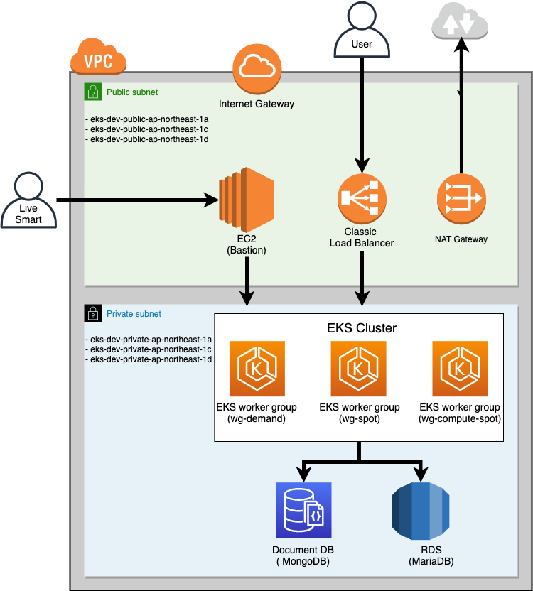

# Repository structure

Repository contains the following:\

* `./terraform` -  Terraform configuration for the EKS cluster running in AWS. 
* `./kube` - All the configurations required for the application running in Kubernetes cluster.
* `./docs` - Directory which contains overview of the components.

Docs are:

* [deployment](./docs/1-deployment.md) - Document which is describing process of cluster installation.

* [AWS resources overview](./docs/2-aws-resources-overview.md) - AWS resources which are used for the deployment and Terraform configurations description

* [Kubernetes resources overview](./docs/3-kubernetes-resources-overview.md) - Overview of used Kubernetes resources.

* [Kubernetes software](./docs/4-software-components-overview.md) - Doc which is describing all software components which are installed in the cluster.

* [Usage](./docs/5-usage.md) - Contains cheatsheet of commands for daily usage of cluster.

# Network

## Development

### VPC

| Name | CIDR |
|---|---|
| eks-dev | 10.0.0.0/16 |

### Subnets

| Name | Type |CIDR |
|---|---|---|
| eks-dev-private-ap-northeast-1a | Private | 10.0.1.0/24 |
| eks-dev-private-ap-northeast-1c | Private | 10.0.2.0/24 |
| eks-dev-private-ap-northeast-1d | Private | 10.0.3.0/24 |
| eks-dev-public-ap-northeast-1a | Public | 10.0.4.0/24 |
| eks-dev-public-ap-northeast-1c | Public | 10.0.5.0/24 |
| eks-dev-public-ap-northeast-1d | Public | 10.0.6.0/24 |
